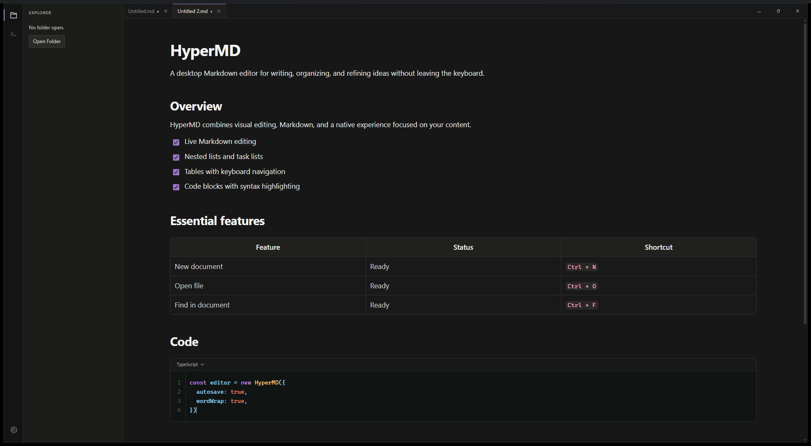
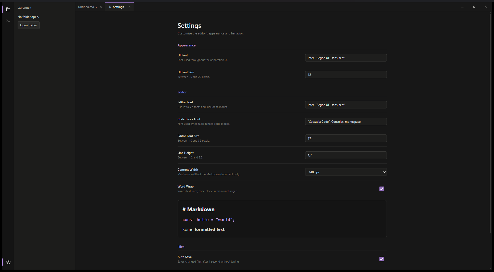

<p align="center">
  
</p>

<h1 align="center">HyperMD</h1>

<p align="center">
  A fast, content-focused Markdown editor for desktop.
</p>

<p align="center">
  Tauri · Svelte · TipTap
</p>

<p align="center">
  
</p>

## Highlights

- Live visual Markdown editing.
- File explorer and tabbed documents.
- Nested lists, task lists, and keyboard-friendly tables.
- Code blocks with syntax highlighting.
- Search, command palette, autosave, and keyboard shortcuts.
- Customizable fonts, content width, and line wrapping.

<p align="center">
  
</p>

## Run locally

Requires Node.js, Rust, and the Tauri system dependencies.

```bash
npm install
npm run tauri dev
```

To run the tests or create a production build:

```bash
npm test
npm run tauri build
```

See [ARCHITECTURE.md](./ARCHITECTURE.md) for source ownership, dependency rules, and the change checklist.

## Linux release

Version tags publish an x86_64 AppImage suitable for CachyOS and other Linux distributions. After downloading it from the GitHub release:

```bash
chmod +x HyperMD_*.AppImage
./HyperMD_*.AppImage
```

`scripts/build.sh` is intended for the Linux job in GitHub Actions. The release workflow publishes the AppImage together with the Windows installer.
